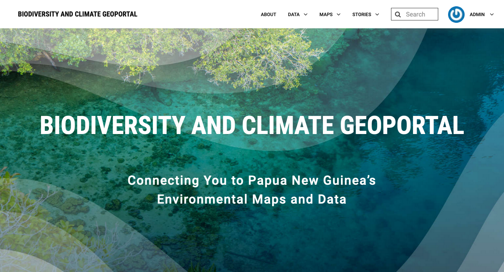

# PNG Biodiversity and Climate GeoPortal

A customised Geonode for creating an open-access online web portal to support mapping and monitoring of the environment and sustainable use of natural resources in Papua New Guinea.

---


## Table of Contents

- [Installation](#installation)
- [Run the instance in development mode](#run-the-instance-in-development-mode)
- [Run the instance on a public site](#run-the-instance-on-a-public-site)
- [Stop the Docker Images](#stop-the-docker-images)
- [Backup and Restore from Docker Images](#backup-and-restore-the-docker-images)
- [Recommended: Track your changes](#recommended-track-your-changes)
- [Hints: Configuring `requirements.txt`](#hints-configuring-requirementstxt)
- [Automating Deployment](#automatic-deployment)
- [Mail Server Setup](#setting-up-a-mail-server)
- [Custom Changes: Differences From Default Geonode](#project-customisations)


## Installation

You need Docker 1.12 or higher, get the latest stable official release for your platform.

1. Prepare the Environment

    ```bash
    git clone https://github.com/GeoNode/geonode-project.git -b <your_branch>
    ```

2. Run `docker-compose` to start it up (get a cup of coffee or tea while you wait)

    ```bash
    docker-compose build --no-cache
    docker-compose up -d
    ```

    ```bash
    set COMPOSE_CONVERT_WINDOWS_PATHS=1
    ```

    before running `docker-compose up`

3. Access the site on http://localhost/

## Run the instance in development mode

### Use dedicated docker-compose files while developing

**NOTE**: In this example we are going to keep localhost as the target IP for GeoNode

  ```bash
  docker-compose -f docker-compose.development.yml -f docker-compose.development.override.yml up
  ```

## Run the instance on a public site

### Preparation of the image (First time only)

**NOTE**: In this example we are going to publish to the public IP http://123.456.789.111

```bash
vim .env
  --> replace localhost with 123.456.789.111 everywhere
```

### Startup the image

```bash
docker-compose up --build -d
```

### Stop the Docker Images

```bash
docker-compose stop
```

### Fully Wipe-out the Docker Images

**WARNING**: This will wipe out all the repositories created until now.

**NOTE**: The images must be stopped first

```bash
docker system prune -a
```

## Backup and Restore from Docker Images

### Run a Backup

```bash
SOURCE_URL=$SOURCE_URL TARGET_URL=$TARGET_URL ./undp_png/br/backup.sh $BKP_FOLDER_NAME
```

- BKP_FOLDER_NAME:
  Default value = backup_restore
  Shared Backup Folder name.
  The scripts assume it is located on "root" e.g.: /$BKP_FOLDER_NAME/

- SOURCE_URL:
  Source Server URL, the one generating the "backup" file.

- TARGET_URL:
  Target Server URL, the one which must be synched.

e.g.:

```bash
docker exec -it django4undp_png sh -c 'SOURCE_URL=$SOURCE_URL TARGET_URL=$TARGET_URL ./undp_png/br/backup.sh $BKP_FOLDER_NAME'
```

### Run a Restore

```bash
SOURCE_URL=$SOURCE_URL TARGET_URL=$TARGET_URL ./undp_png/br/restore.sh $BKP_FOLDER_NAME
```

- BKP_FOLDER_NAME:
  Default value = backup_restore
  Shared Backup Folder name.
  The scripts assume it is located on "root" e.g.: /$BKP_FOLDER_NAME/

- SOURCE_URL:
  Source Server URL, the one generating the "backup" file.

- TARGET_URL:
  Target Server URL, the one which must be synched.

e.g.:

```bash
docker exec -it django4undp_png sh -c 'SOURCE_URL=$SOURCE_URL TARGET_URL=$TARGET_URL ./undp_png/br/restore.sh $BKP_FOLDER_NAME'
# if restoring has failed 
docker exec -it db4undp_png sh -c 'psql -f /$BKP_FOLDER_NAME/undp_png/br/fix_backup.sql'
docker exec -it db4undp_png sh -c 'psql -f /$BKP_FOLDER_NAME/undp_png/br/postfix_geoapps_backup.sql'
```

## Recommended: Track your changes

Step 1. Install Git (for Linux, Mac or Windows).

Step 2. Init git locally and do the first commit:

```bash
git init
git add *
git commit -m "Initial Commit"
```

Step 3. Set up a free account on github or bitbucket and make a copy of the repo there.

## Hints: Configuring `requirements.txt`

You may want to configure your requirements.txt, if you are using additional or custom versions of python packages. For example

```python
Django==2.2.12
git+git://github.com/<your organization>/geonode.git@<your branch>
```

## Automatic deployment

Install node, pm2 and webhooks. PM2 runs our webhooks.

```sh
sudo apt-get install webhook
sudo apt-get install -y nodejs
sudo npm install pm2 -g 
```
Create a hooks.json file.

```json
[
  {
    "id": "redeploy-webhook",
    "execute-command": "/opt/undp_png/redeploy.sh",
    "command-working-directory": "/opt/undp_png/",
    "pass-arguments-to-command":
    [
      {
        "source": "payload",
        "name": "user_name"
      }
    ],
    "response-message": "Executing redeploy script",
    "trigger-rule":
    {
      "match":
      {
        "type": "value",
        "value": "<secret key>",
        "parameter":
        {
          "source": "header",
          "name": "X-Gitlab-Token"
        }
      }
    }
  }
]
```

Copy Letsencrpyt certs and run 
```bash
docker cp -L undp_png_letsencrypt_1:/geonode-certificates/production/live/<machine>/fullchain.pem ~/fullchain.pem
docker cp -L undp_png_letsencrypt_1:/geonode-certificates/production/live/<machine>/privkey.pem ~/privkey.pem
```

`pm2 start ecosystem.config.js`

Visit [Gitlab](https://gitlab.com/mammoth-geospatial/undp_png/-/hooks) setup hook to run on merge-requests and pushs.

## Project Customisations

### Higher Resolution Thumbnails
The core Geonode project sets thumbnail resolution at 240x180, this leads to fairly fuzzy images on the homepage and lists.
We have changed the behaviour to extract the size of the resolution directly from the `THUMBNAIL_GENERATOR_DEFAULT_SIZE` 
in the `settings.py` file. For example default used in our project is.

```python
...
THUMBNAIL_GENERATOR_DEFAULT_SIZE = {"width": 420, "height": 350}
...
```
We have made four changes from the default geonode project, these changes may require reversing or updating to ensure 
future compatibility.

- First we required a new endpoint `base/<resource_id>/thumbnail_upload_large/` which overrides the previous `base/<resource_id>/thumbnail_upload/` endpoint.
- Secondly a number of templates referring the old url have been updated.
- Third we have added a new field to the ResourceBase model and a new model CuratedThumbnailLarge for our new thumbnails.
- Finally we have patched the format_objects method in the API models to use this new model.


### Custom Geoserver Proxy
This adds our Mapbox access tokens correctly to the geoserver proxy.
See `undp_png/views.py` for details.

### Mapbox WMTS background
Ability to add a Mapbox WMTS background layer to the map.
To do so, add the layer as a background layer to the `settings.py` file (make sure to use the legacy `wmts/256` url path).

Edit the function `add_mapbox_wmts_sources` in `undp_png/apps.py` to add any WMTS layers to the source in the same format as the `streets-11` example.

### Alterations to metadata names
We made small adjustments to the following metadata attributes:
- Abstract -> Description
- Attribution -> Source
